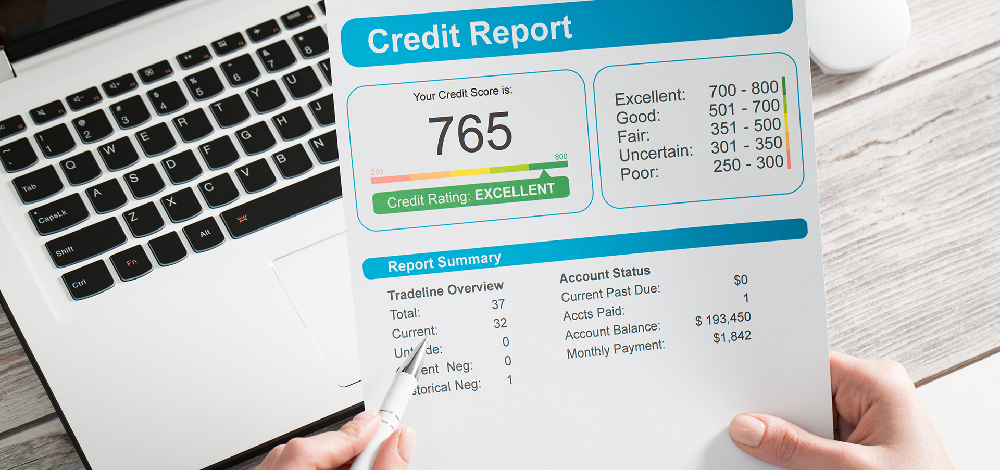

# Module 12 Report 

## Overview of the Analysis

In this section, describe the analysis you completed for the machine learning models used in this Challenge. This might include:

* This analysis is built up for a peer-to-peer lending services company in order to build a model that can identify the creditworthiness of borrowers. 

* Using a logistic regression model to compare two versions of the dataset. First, I use the original dataset. Second, I resample the data by using the `RandomOverSampler` module from the imbalanced-learn library.

* Basic information about the variables for prediction: "y_pred = model.predict(X_test)", "y_pred_oversampled = model_oversampled.predict(X_test)"

* The stages of the machine learning process I went through as part of this analysis. For both cases, I got the count of the target classes, train a logistic regression classifier, calculate the balanced accuracy score, generate a confusion matrix, and generate a classification report.

* I used a logistic regression model to compare two versions of the dataset (`RandomOverSampler`, `LogisticRegression`).

## Results

Using bulleted lists, describe the balanced accuracy scores and the precision and recall scores of all machine learning models.

* Machine Learning Model 1:
  * Description of Model 1 Accuracy, Precision, and Recall scores.
    * Precision: For class 0 (healthy loans): Precision is 1.00 (or 100%). This means that when the model predicts a loan as a healthy loan (class 0), it is correct 100% of the time. For class 1 (high-risk loans): Precision is 0.85 (or 85%). This means that when the model predicts a loan as a high-risk loan (class 1), it is correct 85% of the time.
    * Recall (Sensitivity):For class 0: Recall is 0.99 (or 99%). This means that the model correctly identifies 99% of all actual healthy loans in the dataset. For class 1: Recall is 0.91 (or 91%). This means that the model correctly identifies 91% of all actual high-risk loans in the dataset.
    * F1-Score: For class 0: The F1-score is 1.00. The F1-score is the harmonic mean of precision and recall and is a balanced measure of a model's performance. In this case, it's very high, indicating a strong overall performance for healthy loans. For class 1: The F1-score is 0.88, which is also a good score but slightly lower than for class 0. It balances precision and recall for high-risk loans.
    * Accuracy: The overall accuracy of the model is 0.99 (or 99%), which means that 99% of the total predictions made by the model are correct. Macro Average: The macro average for precision, recall, and F1-score calculates the unweighted mean of these metrics for both classes. In this case, the macro average precision is 0.92, macro average recall is 0.95, and macro average F1-score is 0.94.
    * Weighted Average: The weighted average for precision, recall, and F1-score calculates the weighted mean of these metrics based on the support (the number of samples) for each class. This is useful when there is class imbalance. In this case, the weighted average precision, recall, and F1-score are all 0.99.

**Question:** How well does the logistic regression model predict both the `0` (healthy loan) and `1` (high-risk loan) labels?

**Answer:** The accuracy score is 99.184%. For healthy loans, precision is 1.00, which means that when the logistic regression model predicts a loan as a healthy loan, it is correct 100% of the time. For class 1 (high-risk loans), precision is 0.85, which means that when the logistic regression model predicts a loan as a high-risk loan, it is correct 85% of the time.

---

* Machine Learning Model 2:
  * Description of Model 2 Accuracy, Precision, and Recall scores.
    * Precision: For class 0 (healthy loans): Precision is 1.00 (or 100%). This means that when the model predicts a loan as a healthy loan (class 0), it is correct 100% of the time. For class 1 (high-risk loans): Precision is 0.84 (or 84%). This means that when the model predicts a loan as a high-risk loan (class 1), it is correct 84% of the time.
    * Recall (Sensitivity): For class 0: Recall is 0.99 (or 99%). This means that the model correctly identifies 99% of all actual healthy loans in the dataset. For class 1: Recall is 0.99 (or 99%). This means that the model correctly identifies 99% of all actual high-risk loans in the dataset.
    * F1-Score: For class 0: The F1-score is 1.00. This indicates a perfect balance between precision and recall for healthy loans. For class 1: The F1-score is 0.91. This indicates a good balance between precision and recall for high-risk loans.
    * Accuracy: The overall accuracy of the model is 0.99 (or 99%), which means that 99% of the total predictions made by the model are correct.
    * Macro Average: The macro average for precision, recall, and F1-score calculates the unweighted mean of these metrics for both classes. In this case, the macro average precision is 0.92, macro average recall is 0.99, and macro average F1-score is 0.95.
    * Weighted Average: The weighted average for precision, recall, and F1-score calculates the weighted mean of these metrics based on the support (the number of samples) for each class. In this case, the weighted average precision, recall, and F1-score are all 0.99.

---
    
## Summary

Summarize the results of the machine learning models, and include a recommendation on the model to use, if any. For example:
* Which one seems to perform best? How do you know it performs best?
* Answer: Overall, the classification report for the oversampled data indicates that the model continues to perform very well, with high precision and recall values for both classes. The oversampling technique appears to have addressed the class imbalance, leading to balanced performance metrics for both classes.

* Does performance depend on the problem we are trying to solve? (For example, is it more important to predict the `1`'s, or predict the `0`'s? )
* Answer:Yes. In this case, it is important to predict the "1" label more than "0" label.

* If you do not recommend any of the models, please justify your reasoning.
* **Question:** How well does the logistic regression model, fit with oversampled data, predict both the `0` (healthy loan) and `1` (high-risk loan) labels?

* **Answer:** As the above result, the accuracy score is the same, the precision of 1 label prediction (the high-risk loan) decreases from 85% to 84%, however; the recall number of the high-risk loan has been increased from 91% to 99% This means that the model correctly identifies 99% of all actual high-risk loans in the oversampled dataset, which means the logistic regression model has improved the correctly identifies of all actual high-risk loans in the dataset and that could be more informative result. Besides, the logistic regression model does not have any effect to the prediction of the 0 label (healthy loan) much as we can see the number of precision, recall, and f1-score of 0 label are the same. Moreover, the accuracy score increased from 99.18% to 99.36%. According to the above, I recommend to use the Machine Learning Model 2, which is the logistic regression model with oversampled data.